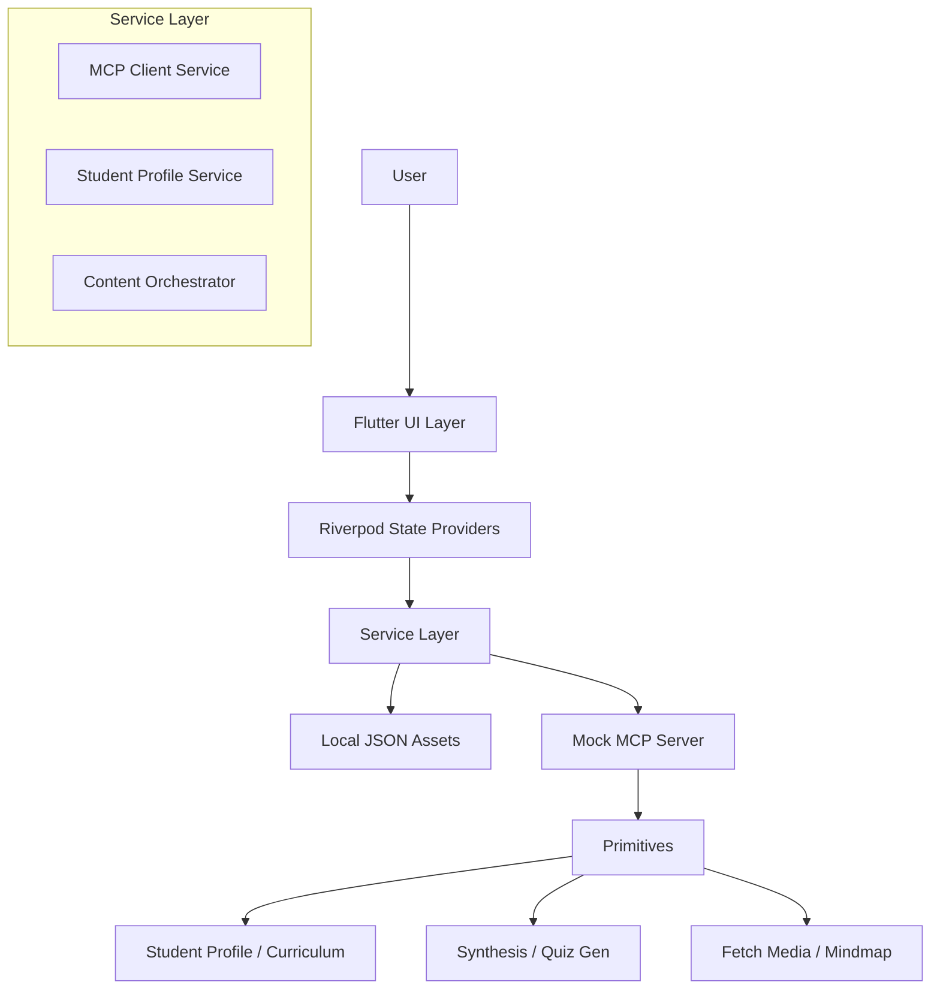

# MCP StudyHub Implementation Plan

## 1. Project Overview
**Goal:** Build a Flutter Windows Desktop application that serves as an MCP (Model Context Protocol) Host for educational content delivery. The app will orchestrate personalized learning experiences using MCP primitives (Resources, Prompts, Tools) without relying on a backend database for the MVP.

## 2. Technology Decisions

| Category | Technology | Reasoning |
| :--- | :--- | :--- |
| **Framework** | Flutter (Windows) | Cross-platform capability with strong Windows desktop support and high-performance rendering. |
| **Language** | Dart | Required for Flutter; strong typing suitable for structured data like MCP messages. |
| **State Management** | Riverpod | Compile-safe, testable, and efficient state management. Easy to segregate UI from logic. |
| **Navigation** | go_router | Declarative routing, handling deep links and complex navigation flows easily. |
| **Serialization** | json_serializable | Robust code generation for JSON parsing (crucial for MCP data exchange). |
| **Rendering** | flutter_markdown | To render synthesis reports (prompts output). |
| **Architecture** | Feature-First + Layered | `features/` for UI modules, `core/` for services/models. Ensures scalability. |
| **Local Data** | JSON Files | Simple, portable, and sufficient for the MVP curriculum requirement. |

## 3. Architecture & Data Flow

### High-Level Architecture

### Data Flow Examples
1.  **Onboarding**: User Input (UI) -> `StudentProfileService` -> Save to `StudentProfile` (Resource/JSON).
2.  **Dashboard Load**: `CurriculumProvider` -> Load `assets/curriculum/` JSON -> Parse to `Curriculum` Model -> UI.
3.  **Synthesis Generation**: User Tap (Learning Hub) -> `MCPClientService.synthesizeReport(chapterId)` -> Call `synthesis_prompt` (Mock/Real) -> Return Markdown -> UI Render.

## 4. Task Breakdown & Dependencies

### Phase 2: Scaffolding (Dependencies: Phase 1 Approval)
-   [ ] **Init:** `flutter create --platforms=windows mcp_studyhub`
-   [ ] **Deps:** Add `flutter_riverpod`, `riverpod_annotation`, `go_router`, `json_annotation`, `dev:build_runner`, `json_serializable`, `flutter_markdown`.
-   [ ] **Structure:** Create folders: `core/`, `features/`, `shared/` per request.
-   [ ] **Models:** Create `StudentProfile`, `Curriculum`, `Chapter`, `LearningContent` with `@JsonSerializable`.
-   [ ] **Assets:** Setup `assets/curriculum/` with sample JSONs for Grade 10 & 12.
-   [ ] **Routing:** Setup `GoRouter` with initial routes.

### Phase 3: Feature Development (Dependencies: Phase 2)
-   [ ] **Onboarding:**
    -   Create UI for Grade, Interests, Learning Style.
    -   Implement `StudentProfileProvider` to save data locally (SharedPreferences or File).
-   [ ] **Dashboard:**
    -   Create responsive Grid UI.
    -   Implement filtering based on `StudentProfile.grade`.
-   [ ] **Chapter Index:**
    -   List View of chapters.
    -   Implement `CurriculumProvider` to read JSON from assets.
-   [ ] **Learning Hub (Shell):**
    -   Tabbed Interface (Synthesis, Active Learning, Multimedia).
    -   Shared Header & Progress Bar.
-   [ ] **Tab 1: Synthesis:**
    -   UI for Markdown display.
    -   Mock `MCPClientService` to return dummy markdown report.
    -   Interactive Mindmap placeholder.
-   [ ] **Tab 2: Active Learning:**
    -   Flashcard Widget (Animation).
    -   Quiz Widget (State management for answers/score).
-   [ ] **Tab 3: Multimedia:**
    -   Video Player or Link List.
    -   Infographics Carousel.

### Phase 4: MCP Integration (Dependencies: Phase 3)
-   [ ] **Service Logic:** Refine `MCPClientService` to handle "Prompt" and "Tool" requests structurally.
-   [ ] **Synthesis Integration:** Connect "Regenerate" button to `synthesis_prompt`.
-   [ ] **Quiz Integration:** Connect Quiz generation to `scaffolding_prompt`.
-   [ ] **Resource Integration:** Connect Multimedia tab to `fetch_multimedia` tool.
-   [ ] **Mocking:** Ensure all MCP calls have robust mock implementations for offline demo.

### Phase 5: Polish & Windows Specifics (Dependencies: Phase 4)
-   [ ] **Title Bar:** Custom Windows title bar if needed (using `bitsdojo_window` or similar, if requested, else standard).
-   [ ] **Transitions:** Add smooth page transitions.
-   [ ] **Loading States:** Add Shimmers/Spinners for async MCP calls.
-   [ ] **Validation:** `flutter analyze` & fix lints.
-   [ ] **Documentation:** Update README with how to run and directory structure.

## 5. Risk Assessment

| Risk | Impact | Mitigation |
| :--- | :--- | :--- |
| **Windows Plugin Compatibility** | High | Use stable, well-supported packages. Test frequently on Windows target. |
| **MCP Complexity** | Medium | Abstract MCP logic behind a robust `ClientService` interface. Start with simple Mocks. |
| **State Persistence** | Medium | Use simple File I/O or SharedPreferences for MVP. Avoid complex databases. |
| **UI Polishing** | Low | Stick to Material 3 defaults where possible, use Flutter's flexibility for custom aesthetics. |

## 6. Testing Strategy
-   **Static Analysis**: Run `flutter analyze` after every major feature implementation.
-   **Manual Testing**:
    -   Verify standard user flows (Onboarding -> Dashboard -> Chapter -> Content).
    -   Test "Offline" capabilities (since using local JSON).
    -   Verify Window resizing behaviour.
-   **Unit Tests**: (Optional for MVP but recommended) Test JSON parsing logic and `MCPClientService` mocks.
